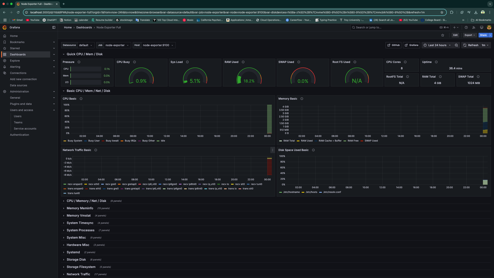

# 📊 DevOps Engineer Take-Home Assessment

This project demonstrates a monitoring, alerting, and visualization system suitable for ensuring system reliability at scale. It uses modern DevOps tools like **Prometheus**, **Grafana**, **Node Exporter**, **Alertmanager**, and **Docker Compose** to monitor server health and notify the team when things go wrong.

---

## 📌 Overview

At Linq, maintaining infrastructure uptime, performance, and reliability is critical. This solution provides:

- ✅ Real-time monitoring of system metrics (CPU, memory, disk, network)
- ✅ Alerting on high resource usage
- ✅ Visualization through a Grafana dashboard
- ✅ Scalable architecture with Docker Compose

---

## 🚀 Part 1: Monitoring Design

### ✅ Metrics to Monitor
- **CPU Usage**
- **Memory Usage**
- **Disk Usage**
- **Network Latency / I/O**

### 🧰 Tools to Collect Metrics
- [Node Exporter](https://github.com/prometheus/node_exporter): Exposes system metrics
- [Prometheus](https://prometheus.io): Scrapes and stores metrics
- Optional: Python script to generate mock telemetry data

### 💾 Metrics Storage Backend
- **Prometheus** is used as the time-series database for its integration with alerting and Grafana

---

## 🚨 Part 2: Alerting

### ⚠️ Alert Conditions
- CPU usage > 85% for more than 2 minutes
- Memory usage > 90%
- Disk usage > 90%
- Node down/unreachable

### 🔔 Delivery Methods
- Slack (via Webhook)

### 🛠️ Tools for Alerting
- **Prometheus Alertmanager** routes alerts to configured receivers
- Integrated with Slack using a webhook URL

---

## 🛠️ Part 3: Implementation & Scalability

### 🧪 Minimal Working System
Deployed with **Docker Compose**, includes:

- **Prometheus** – metrics storage
- **Node Exporter** – system metrics collector
- **Grafana** – dashboard visualizer
- **Alertmanager** – alert delivery system

### 📂 Project Structure

- **Directory Setup**:
devops-monitoring/
├── docker-compose.yml
├── prometheus/
│   └── prometheus.yml
├── alertmanager/
│   └── alertmanager.yml
├── grafana/
│   └── dashboards/
├── README.md

### 📈 Scalability
- Add more servers by installing Node Exporter on each and updating Prometheus targets
- Use service discovery (e.g., Kubernetes, DNS, EC2 tags) for dynamic scaling
- Grafana supports templated dashboards for multiple nodes

---

## 📊 Part 4: Visualization Dashboard

### 🖥️ Grafana Setup

1. Go to: `http://localhost:3000`
2. Login: `admin / admin`
3. Add Prometheus data source: `http://prometheus:9090`
4. Import dashboard ID **1860** (Node Exporter Full)

### 📷 Screenshots

#### ✅ Grafana Dashboard

#### ✅ Prometheus Targets

Happy coding!# DevOps-Engineer-Take-Home-Submission
# DevOps-Engineer-Take-Home-Submission
